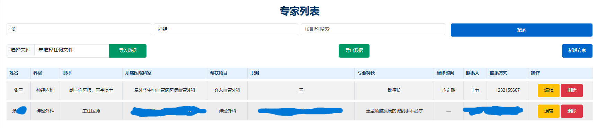
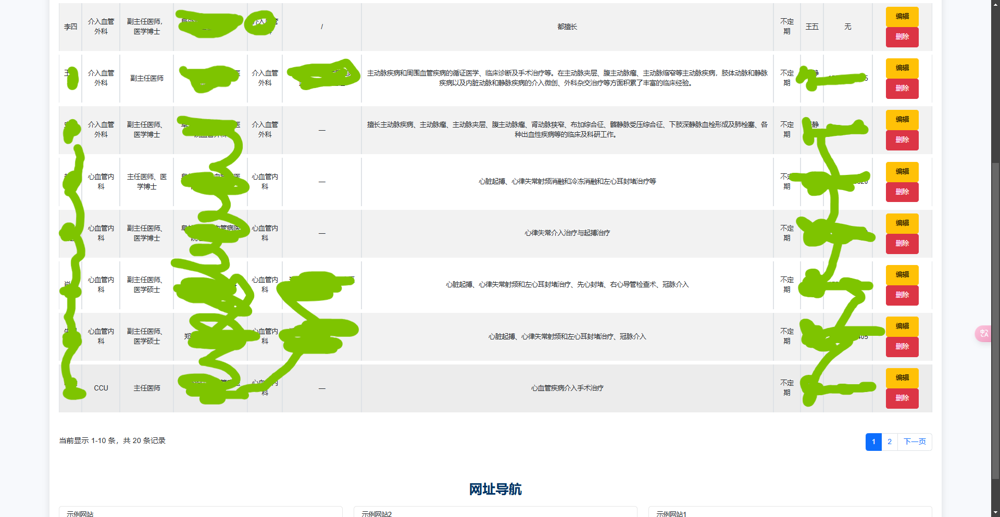

# HospitalManageInfo.web
## 项目名称
专家列表与网址导航

## 项目描述
本项目是一个基于 Django 框架的专家管理系统，主要用于管理和展示医院专家信息。通过项目，用户可以：

- 搜索专家信息（姓名、科室、职称）
- 导入/导出专家数据
- 新增、编辑或删除专家
- 分页显示专家列表
- 提供相关网址导航

## 技术栈
- **后端**：Django 5.1.5
- **前端**：HTML、Bootstrap 5
- **数据库**：SQLite
- **文件导入导出**：`pandas` 与 `django-import-export`

## 文件结构
- `templates/`: 存放 HTML 模板文件
- `static/`: 包含 CSS 文件及其他静态资源
- `views.py`: 定义了页面逻辑及导入导出功能
- `urls.py`: 定义了 URL 路由
- `models.py`: 定义了专家信息的数据库模型

## 功能描述
### 1. 搜索功能
用户可以通过输入姓名、科室或职称快速定位专家信息。

### 2. 导入/导出功能
- **导入数据**：支持通过 Excel 文件导入专家信息（需确保列名匹配）。
- **导出数据**：一键导出当前专家列表为 Excel 文件。

### 3. 专家列表
- 分页显示专家数据，每页展示若干条记录。
- 列表包括专家的基本信息（姓名、科室、职称等）及操作按钮（编辑、删除）。

### 4. 新增专家
提供快捷按钮直接跳转至新增专家页面（Django Admin界面）。

### 5. 网址导航
在页面底部提供常用链接导航，便于用户快速访问外部资源。

## 实现情况
1. 搜索框示例
   - 位置：搜索框模块
   - 示例截图：搜索李姓的神经领域相关专家。
   - **GitHub 内连接**：`assets/search_example.png`

2. 专家列表
   - 位置：专家信息表格
   - 示例截图：展示多条专家记录的分页列表。
   - **GitHub 内连接**：`assets/expert_list1.png`

3. 新增专家
   - 位置：新增专家按钮
   - 示例截图：新增专家的输入表单页面。
   - **GitHub 内连接**：`assets/add_expert.png`

4. 网址导航
   - 位置：导航链接部分
   - 示例截图：展示链接导航的卡片式布局。
   - **GitHub 内连接**：`assets/navigation.png`

## 注意事项
1. **导入文件格式**：确保导入的 Excel 文件列名与数据库字段一致。
   - 示例列名：`姓名`、`科室`、`职称` `所属医院科室`等。
2. **权限管理**：使用 Django Admin 或自定义权限管理，确保只有授权用户能新增、修改、删除数据。
3. **错误处理**：对上传文件进行格式校验，防止错误数据影响系统。

